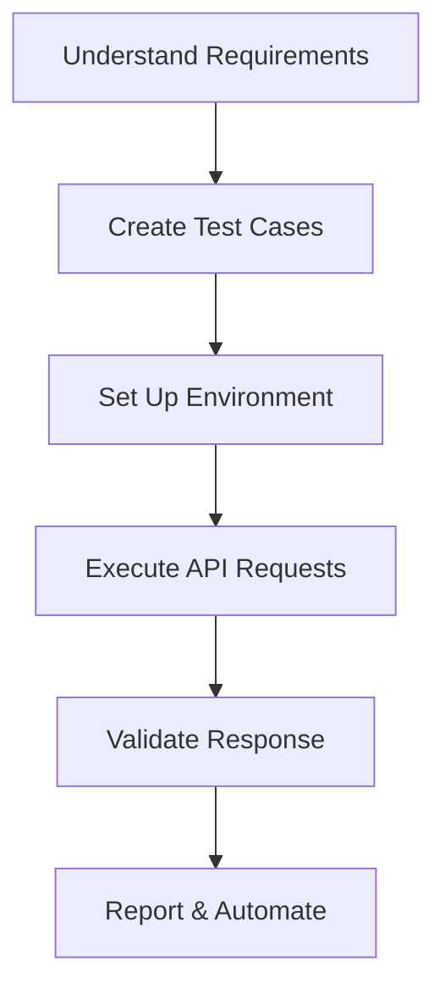

# Software-Testing
#  1. 🧪 Software Testing ( API )

## 📌 What is Software Testing?
Software testing is the process of **evaluating and verifying** that a software application or system works as expected.  
It ensures the product is **free of bugs**, **meets requirements**, and provides a **good user experience**.

---

## 🎯 Objectives of Software Testing
- Detect and fix defects before release
- Ensure software meets **business and user requirements**
- Improve **quality, reliability, and performance**
- Reduce risks and prevent future issues

---

## 🛠️ Types of Software Testing
### 1. Manual Testing
- Testers execute test cases **without automation tools**  
- Examples: Exploratory Testing, Ad-hoc Testing  

### 2. Automation Testing
- Uses **scripts and tools** to run tests automatically  
- Examples: Selenium, JUnit, TestNG, PyTest  

---

## 🔄 Levels of Testing
1. **Unit Testing** → Testing individual components/modules  
2. **Integration Testing** → Testing combined modules  
3. **System Testing** → Testing the complete system  
4. **Acceptance Testing (UAT)** → Validation by end-users  

---

## 🧩 Types of Testing
- **Functional Testing** → Verifies *what* the system does  
- **Non-Functional Testing** → Verifies *how well* it performs (performance, security, usability, etc.)  
- **Regression Testing** → Ensures new changes don’t break existing features  
- **Smoke Testing** → Basic checks to confirm build stability  
- **Sanity Testing** → Quick checks on new functionality  

---

## 🔁 Software Testing Life Cycle (STLC)
1. Requirement Analysis  
2. Test Planning  
3. Test Case Development  
4. Environment Setup  
5. Test Execution  
6. Test Closure  

---

## ✅ Benefits of Software Testing
- Improves **quality & reliability**  
- Saves **costs & time** (bugs fixed early are cheaper)  
- Enhances **customer satisfaction**  
- Reduces **risk of failure**  

---

👨‍💻 *Example:*  
For an **E-commerce app**, testing includes:  
- Login functionality  
- Product search & filter  
- Add-to-cart & checkout  
- Payment gateway integration  
- Security & performance testing  

---
---
# 2. 🌐 API Testing

## 📌 What is API Testing?
API Testing is a type of software testing that focuses on verifying **Application Programming Interfaces (APIs)** directly.  
It ensures that APIs work as expected in terms of **functionality, reliability, performance, and security** without relying on the frontend.

---

## 🎯 Objectives of API Testing
- Validate **endpoints, methods, and data formats**
- Ensure **data integrity** between client ↔️ server
- Verify **business logic** at the API layer
- Check for **performance, security, and error handling**

---

## 🔑 Key Features of API Testing
- Does not need a GUI (can test directly with tools like **Postman, cURL, or automation scripts**)  
- Works with **HTTP methods**:  
  - `GET` → Retrieve data  
  - `POST` → Create data  
  - `PUT` → Update data  
  - `DELETE` → Remove data  
- Uses **data formats**: JSON, XML, YAML  

---

## 🛠️ Tools for API Testing
- **Postman** → Manual & automated API tests  
- **SoapUI** → SOAP & REST API testing  
- **JMeter** → Performance testing  
- **Newman** → Run Postman collections via CLI  
- **REST Assured / PyTest / JUnit** → Automation frameworks  

---

## 🔄 API Testing Process
1. **Understand API Requirements**  
   - Endpoints, request/response format, headers, authentication  
2. **Set Up Test Environment**  
   - Ensure API server and test database are running  
3. **Send API Requests**  
   - Use tools/scripts to send requests (GET/POST/PUT/DELETE)  
4. **Validate Responses**  
   - Check status codes (e.g., `200 OK`, `404 Not Found`, `500 Internal Server Error`)  
   - Verify response body, headers, time, and schema  
5. **Automate & Integrate**  
   - Run in CI/CD pipelines (Jenkins, GitHub Actions, GitLab CI, etc.)  

---

## 📂 Example API Test Cases

### ✅ Functional Test
- Verify `GET /users` returns a **200 OK** and list of users.  
- Verify `POST /users` creates a user with valid data.  
- Verify `DELETE /users/{id}` removes the correct user.  

### 🔒 Security Test
- Ensure `POST /users` with **invalid token** returns **401 Unauthorized**.  
- Verify SQL injection or XSS attacks are blocked.  

### ⚡ Performance Test
- API should respond within **200ms** for 90% of requests.  
- Handle **1000+ requests/second** without crashing.  

---

## 📊 API Testing Life Cycle

## 👨‍💻 Example with cURL:
```
# GET request
curl -X GET https://api.example.com/users

# POST request
curl -X POST https://api.example.com/users \
  -H "Content-Type: application/json" \
  -d '{"name": "Anil", "email": "anil@example.com"}'
```
## ✅ Benefits of API Testing
- Faster & more reliable than GUI testing
- Detects issues early at the integration layer
- Ensures data security and performance
- Reduces overall testing cost

---
--- 

# 3. 📬 Postman – API Testing Tool
### 📌 What is Postman?
Postman is a **collaboration platform** for API development and testing.  
It allows developers and testers to **send HTTP requests**, **inspect responses**, **create collections**, and **automate testing**.

---

### 🎯 Why Use Postman?
- Easy to use (GUI-based, no coding required for basic testing)  
- Supports all HTTP methods: `GET`, `POST`, `PUT`, `PATCH`, `DELETE`  
- Works with multiple data formats: JSON, XML, form-data, raw text  
- Enables **environment setup** (e.g., dev, staging, prod)  
- Provides **automation and CI/CD integration** (via Newman)  

---

### 🔑 Postman Features
- **Collections** → Save and organize API requests  
- **Environment Variables** → Store base URLs, tokens, keys  
- **Pre-request Scripts** → Run JS code before sending a request  
- **Tests (Assertions)** → Validate responses automatically  
- **Newman** → Run collections via CLI for automation  
- **Mock Servers** → Simulate APIs before backend is ready  

---

### 🛠️ Basic Workflow
1. **Install Postman** → Download from [https://www.postman.com/downloads/](https://www.postman.com/downloads/)  
2. **Create a Request** → Choose method (`GET`, `POST`, etc.), enter API URL  
3. **Add Headers/Body** → e.g., `Content-Type: application/json`  
4. **Send Request** → Click **Send** and check response  
5. **Save to Collection** → Organize requests for reuse  
6. **Write Tests** → Add JS snippets to validate responses  

---

## 📂 Example API Test in Postman
### GET Request
- URL: `https://reqres.in/api/users/2`  
- Expected Response:
```json
{
  "data": {
    "id": 2,
    "email": "janet.weaver@reqres.in",
    "first_name": "Janet",
    "last_name": "Weaver"
  }
}
```
### POST Request
- URL: `https://reqres.in/api/users`
- Body (JSON):
```json
{
  "name": "Anil",
  "job": "Engineer"
}
```
- Expected Response: 201 Created
---

## 🧪 Writing Tests in Postman
- Inside the Tests tab, add JS code like:
```
// Check status code
pm.test("Status code is 200", function () {
    pm.response.to.have.status(200);
});

// Check response body
pm.test("Response has user ID", function () {
    var jsonData = pm.response.json();
    pm.expect(jsonData.data.id).to.eql(2);
});
```

## 🔄 Running Tests via Newman (CLI)
```
npm install -g newman                                     # Install Newman globally
newman run MyCollection.json                              # Run a Postman collection
newman run MyCollection.json -e dev_environment.json      # Run with environment file
```
---
## ✅ Benefits of Postman
- Simple GUI for beginners
- Powerful automation for advanced testers
- Great for API exploration, debugging, and documentation
- Integrates with CI/CD pipelines
